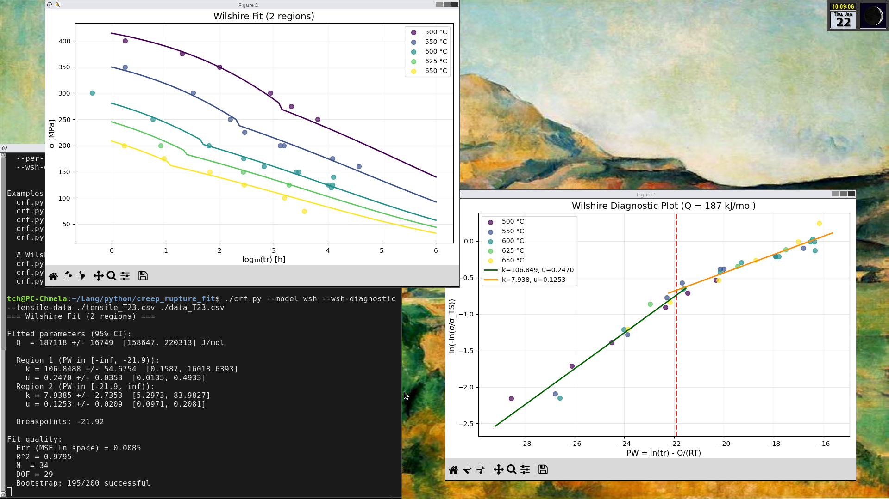

# Creep Rupture Fitting Tool

**Version 0.2.0** (2026-01-21)

CLI tool for fitting creep rupture equations to experimental data.



## What is this tool for?

When designing power plants, pressure vessels, or other high-temperature equipment, engineers need to predict how long a material will last under stress before it breaks. This is called **creep rupture life**.

Testing materials for 100,000 hours (11+ years) is impractical. Instead, we run shorter tests at higher temperatures and use mathematical models to **extrapolate** the results to real operating conditions.

This tool fits two such models to your experimental data:
- **Larson-Miller (LM)** - classic parametric approach, simpler
- **Wilshire (WSH)** - normalized approach, often more accurate for extrapolation

---

## Quick Start

```bash
# Install dependencies
pip install numpy scipy matplotlib

# Run with sample data (Larson-Miller model)
python3 crf.py example/data_T23.csv

# Run Wilshire model (requires tensile strength data)
python3 crf.py example/data_T23.csv --model wsh --tensile-data example/tensile_T23.csv

# Predict stress for 100,000 hours service life
python3 crf.py example/data_T23.csv --predict-tr 100000
```

---

## Contents

1. [Installation](#installation)
2. [Usage](#usage)
3. [Input Data Format](#input-data-format)
4. [Output Formats](#output-formats)
5. [Understanding the Output](#understanding-the-output)
6. [Which Model to Use?](#which-model-to-use)
7. [References](#references)
8. [Appendix: Mathematical Background](#appendix-mathematical-background)

---

## Installation

### Dependencies

**Option 1: Virtual environment (recommended)**

Using a virtual environment prevents dependency conflicts and does not affect your system Python.

```bash
# Create and activate virtual environment
python3 -m venv venv
source venv/bin/activate    # Linux/macOS
# venv\Scripts\activate     # Windows

# Install dependencies
pip install numpy scipy matplotlib
```

**Option 2: System packages (Debian/Ubuntu)**

```bash
sudo apt install python3-numpy python3-scipy python3-matplotlib
```

**Option 3: User install**

If pip complains about "externally-managed-environment" (PEP 668):

```bash
pip install --user numpy scipy matplotlib
```

### Project Structure

```
creep_rupture_fit/
├── crf.py                # Main CLI
├── version.py            # Version info
├── models/
│   ├── __init__.py       # Package exports
│   ├── lm.py             # Larson-Miller model
│   └── wsh.py            # Wilshire model
└── example/
    ├── data_T23.csv      # Sample creep data
    └── tensile_T23.csv   # Tensile strength data
```

---

## Usage

### Basic Syntax

```bash
python3 crf.py <input_file> [--model {lm,wsh}] [OPTIONS]
```

### Common Arguments

| Argument | Description | Default |
|----------|-------------|---------|
| `input_file` | Input data file (required) | - |
| `--version` | Show version and exit | - |
| `--model {lm,wsh}` | Model type | lm |
| `--predict-tr TIME` | Predict stress for given time [h] | - |
| `--predict-temps` | Temperatures for prediction [C], comma-separated | 500,550,600,650 |
| `--no-plot` | Disable plot | - |
| `--plot-output FILE` | Save plot to file (PNG/PDF) | - |
| `--output-format` | Output format: text, json, csv | text |
| `--temp-unit {C,K}` | Temperature unit in input data | C |

### Confidence Intervals

| Argument | Description | Default |
|----------|-------------|---------|
| `--no-confidence` | Disable confidence intervals (faster) | - |
| `--bootstrap N` | Number of bootstrap iterations | 200 |
| `--seed SEED` | Random seed for reproducibility | - |

### Larson-Miller Arguments

| Argument | Description | Default |
|----------|-------------|---------|
| `-n, --order {1,2}` | Polynomial order | 1 |
| `--fix-c VALUE` | Fix constant C to specific value | - |

### Wilshire Arguments

| Argument | Description | Default |
|----------|-------------|---------|
| `--tensile-data FILE` | Tensile strength data file (**required**) | - |
| `--fix-q VALUE` | Fix activation energy Q [J/mol] | - |
| `--wsh-regions BOUNDS` | Manual breakpoints, e.g. "-23" or "-25,-20" | auto |
| `--per-region-q` | Estimate separate Q for each region (advanced) | - |
| `--wsh-diagnostic [FILE]` | Show/save diagnostic plot | - |

**Typical activation energy values** (use with `--fix-q` if auto-detection gives unreasonable results):

| Material | Q [kJ/mol] | Q [J/mol] for --fix-q |
|----------|------------|----------------------|
| Al alloys | 130-150 | 130000-150000 |
| Carbon steels | 180-250 | 180000-250000 |
| Cr-Mo steels (T22, T23) | 200-280 | 200000-280000 |
| Austenitic stainless steels | 250-350 | 250000-350000 |
| Ni superalloys | 280-400 | 280000-400000 |

### Examples

```bash
# Basic Larson-Miller fit (simplest usage)
python3 crf.py example/data_T23.csv

# Larson-Miller with polynomial order 2 and fixed C=20
python3 crf.py example/data_T23.csv -n 2 --fix-c 20

# Disable confidence intervals for faster execution
python3 crf.py example/data_T23.csv --no-confidence

# Wilshire model (requires tensile strength data!)
python3 crf.py example/data_T23.csv --model wsh --tensile-data example/tensile_T23.csv

# Wilshire with fixed activation energy and manual breakpoint
python3 crf.py example/data_T23.csv --model wsh --tensile-data example/tensile_T23.csv \
    --fix-q 198000 --wsh-regions=-23

# Wilshire with diagnostic plot (shows linearized data)
python3 crf.py example/data_T23.csv --model wsh --tensile-data example/tensile_T23.csv \
    --wsh-diagnostic

# Predict allowable stress for 100,000 h at various temperatures
python3 crf.py example/data_T23.csv --model wsh --tensile-data example/tensile_T23.csv \
    --predict-tr 100000

# Export results to JSON
python3 crf.py example/data_T23.csv --output-format json > results.json

# Save plot to file (does not display window)
python3 crf.py example/data_T23.csv --plot-output fit.png
```

---

## Input Data Format

### Creep Data

Three columns in this order:
1. **stress** [MPa]
2. **temperature** [°C or K]
3. **time to rupture** [h]

```
# sigma [MPa], T [C], tr [h]
350, 500, 100
320, 500, 500
280, 550, 200
250, 600, 1500
```

Supported delimiters: comma, semicolon, tab, spaces (auto-detected).
Lines starting with `#` are ignored.

### Tensile Strength Data (required for Wilshire model)

Two columns in this order:
1. **temperature** [°C or K, must match `--temp-unit`]
2. **tensile strength** [MPa]

```
# T [C], sigma_TS [MPa]
20, 596
500, 449
550, 396
600, 337
650, 270
```

---

## Output Formats

### Text (default)

```
=== Wilshire Fit (2 regions) ===

Fitted parameters (95% CI):
  Q  = 198000 +/- 5000  [188000, 208000] J/mol

  Region 1 (PW in [-inf, -23.0)):
    k = 150.2286 +/- 20.5  [110.2, 190.3]
    u = 0.2450 +/- 0.015  [0.215, 0.275]
  Region 2 (PW in [-23.0, inf)):
    k = 8.9475 +/- 1.2  [6.5, 11.4]
    u = 0.1217 +/- 0.008  [0.106, 0.138]

  Breakpoints: -23.00

Fit quality:
  Err (MSE ln space) = 0.0089
  R^2 = 0.9784
  N  = 34
  DOF = 29
  Bootstrap: 195/200 successful

Predictions for tr = 100000 h:
  T = 500 C: sigma = 190.9 MPa
  T = 550 C: sigma = 135.3 MPa
  T = 600 C: sigma = 90.6 MPa
  T = 650 C: sigma = 56.0 MPa
```

### JSON

```json
{
  "model": "wilshire",
  "fit": {
    "Q": 198000,
    "regions": [
      {"k": 150.23, "u": 0.245, "PW_min": null, "PW_max": -23},
      {"k": 8.95, "u": 0.1217, "PW_min": -23, "PW_max": null}
    ],
    "mse": 0.0089,
    "r_squared": 0.9784
  },
  "confidence_intervals": { ... }
}
```

Use `--output-format json` to get full output including confidence intervals and predictions.

---

## Understanding the Output

### Fit Quality Indicators

| Indicator | Good Value | Warning Signs |
|-----------|------------|---------------|
| **R²** | > 0.95 | < 0.90 indicates poor fit |
| **MSE** | As low as possible | Compare between models |
| **Bootstrap success** | > 90% | < 50% indicates unstable fit |

### What if the fit is poor?

1. **Check your data** - are there outliers or typos?
2. **Try different model** - Wilshire often works better than Larson-Miller
3. **Try order 2** for Larson-Miller (`-n 2`)
4. **Check temperature units** - mixing °C and K is a common mistake
5. **For Wilshire** - try fixing Q to a literature value (`--fix-q`)

### Confidence Intervals

The output shows 95% confidence intervals for each parameter:
```
C = 23.54 +/- 0.98  [21.23, 24.99]
      ^       ^      ^      ^
      |       |      |      +-- upper bound (97.5%)
      |       |      +--------- lower bound (2.5%)
      |       +---------------- standard error
      +------------------------ fitted value
```

**Wide confidence intervals** (large +/- value) mean the parameter is uncertain. This can happen with:
- Too few data points
- Data not covering enough temperature/stress range
- Model not suitable for the data

### Predictions

When using `--predict-tr`, the tool calculates allowable stress for given service life:
```
Predictions for tr = 100000 h:
  T = 500 C: sigma = 190.9 MPa   <- At 500°C, material lasts 100,000 h at 190.9 MPa
  T = 600 C: sigma = 90.6 MPa    <- At 600°C, only 90.6 MPa is allowable
```

**"no solution in range"** means the model cannot predict stress for those conditions (extrapolation too far).

---

## Which Model to Use?

### Quick Recommendation

| Situation | Recommended Model |
|-----------|-------------------|
| Quick analysis, limited data | Larson-Miller (default) |
| Accurate extrapolation needed | Wilshire |
| No tensile strength data available | Larson-Miller |
| Data shows mechanism change (break in curve) | Wilshire with regions |

### Larson-Miller

**Pros:**
- Simple, well-established (since 1952)
- Works with creep data only
- Fewer parameters

**Cons:**
- Less accurate for long extrapolations
- Cannot capture mechanism changes

### Wilshire

**Pros:**
- Better extrapolation accuracy
- Captures mechanism changes (multi-region)
- Normalized by tensile strength (physically meaningful)

**Cons:**
- Requires tensile strength data
- More complex
- More parameters to fit

---

## References

1. Larson, F.R., Miller, J. (1952). "A Time-Temperature Relationship for Rupture and Creep Stresses". *Transactions of the ASME*, 74, 765-775.

2. Wilshire, B., Scharning, P.J., Hurst, R. (2007). "A new approach to creep data assessment". *Materials Science and Engineering A*, 510-511, 3-6.

3. Penny, R.K., Marriott, D.L. (1995). *Design for Creep*. Chapman & Hall.

4. Holdsworth, S.R. et al. (2008). "Factors influencing creep model equation selection". *International Journal of Pressure Vessels and Piping*, 85, 80-88.

---

## Appendix: Mathematical Background

This section contains detailed mathematical formulations for those who need them.

### Creep and Time to Rupture

Creep is time-dependent plastic deformation of material under constant stress and temperature. For engineering applications, the key quantity is **time to rupture** ($t_r$), which depends on:

- **Stress** $\sigma$ [MPa]
- **Temperature** $T$ [K]

Both models allow **extrapolation** of short-term high-temperature tests to long-term operating conditions (typically 100,000 h).

### Thermal Activation

Creep processes are thermally activated and follow Arrhenius kinetics:

$$\dot{\varepsilon} \propto \exp\left(-\frac{Q}{RT}\right)$$

where $Q$ is activation energy and $R = 8.314$ J/(mol·K) is the universal gas constant.

---

### Larson-Miller Model

#### Larson-Miller Parameter

Larson and Miller (1952) introduced parameter $P_{LM}$ that combines temperature and time effects:

$$P_{LM} = T \cdot (C + \log_{10} t_r)$$

where:
- $T$ is absolute temperature [K]
- $t_r$ is time to rupture [h]
- $C$ is material constant (typically 15-25)

#### Mathematical Formulation

The Larson-Miller parameter is a function of stress, approximated by a polynomial:

$$P_{LM}(\sigma) = \sum_{i=0}^{n} a_i \cdot (\log_{10}\sigma)^i$$

Explicit expression for time to rupture:

$$\boxed{\log_{10} t_r = \frac{1}{T} \sum_{i=0}^{n} a_i (\log_{10}\sigma)^i - C}$$

#### Supported Polynomial Orders

| Order | Parameters | Equation $P_{LM}(\sigma)$ |
|-------|------------|---------------------------|
| 1 (default) | $C, a_0, a_1$ | $a_0 + a_1 \log_{10}\sigma$ |
| 2 | $C, a_0, a_1, a_2$ | $a_0 + a_1 \log_{10}\sigma + a_2 (\log_{10}\sigma)^2$ |

#### Stress Prediction (Inverse Problem)

For given target time $t_r^{\text{target}}$ and temperature $T$ we solve:

$$P_{LM}(\sigma) = T \cdot (C + \log_{10} t_r^{\text{target}}) = k$$

**Order 1:** Linear equation
$$x = \frac{k - a_0}{a_1}, \quad \sigma = 10^x$$

**Order 2:** Quadratic equation
$$a_2 x^2 + a_1 x + (a_0 - k) = 0$$

Discriminant $D = a_1^2 - 4a_2(a_0 - k)$, roots $x_{1,2} = \frac{-a_1 \pm \sqrt{D}}{2a_2}$

The smaller positive value $\sigma = 10^x$ in range $[0.1, 1000]$ MPa is selected.

---

### Wilshire Model

#### Basic Equation

Wilshire et al. (2007) proposed a normalized approach using tensile strength:

$$\boxed{\frac{\sigma}{\sigma_{TS}} = \exp\left(-k \cdot \left(t_r \cdot \exp\left(-\frac{Q}{RT}\right)\right)^u\right)}$$

where:
- $\sigma$ is applied stress [MPa]
- $\sigma_{TS}$ is tensile strength at creep temperature [MPa]
- $t_r$ is time to rupture [h]
- $T$ is temperature [K]
- $Q$ is activation energy [J/mol]
- $k, u$ are dimensionless model parameters

#### Wilshire Parameter

For linearization we define the Wilshire parameter:

$$P_W = \ln\left(t_r \cdot \exp\left(-\frac{Q}{RT}\right)\right) = \ln(t_r) - \frac{Q}{RT}$$

#### Linearized Form

Taking logarithm of the basic equation:

$$\ln\left(-\ln\left(\frac{\sigma}{\sigma_{TS}}\right)\right) = \ln(k) + u \cdot P_W$$

With substitution $y = \ln(-\ln(\sigma/\sigma_{TS}))$:

$$\boxed{y = \ln(k) + u \cdot P_W}$$

This is **linear regression** with parameters:
- Intercept: $\ln(k)$
- Slope: $u$

#### Multi-Region Approach

For many materials, **breaks** appear in the $y$ vs $P_W$ plot (changes in creep mechanism). The model supports automatic detection or manual specification of regions.

**Example for T23 steel:**

| Region | Condition | $k$ | $u$ |
|--------|-----------|-----|-----|
| 1 | $P_W < -23$ | 148.8 | 0.2451 |
| 2 | $P_W \geq -23$ | 8.904 | 0.1218 |

Common activation energy: $Q = 198$ kJ/mol

#### Automatic Breakpoint Detection (BIC)

The algorithm finds optimal number and positions of breakpoints using **Bayesian Information Criterion**:

$$\text{BIC} = n \cdot \ln(\text{MSE}) + p \cdot \ln(n)$$

where:
- $n$ is number of data points
- $p$ is number of parameters ($2 \times$ number of regions)
- MSE is mean squared error

**Procedure:**
1. For 1, 2, ..., $k_{max}$ regions:
   - Find optimal breakpoint positions (brute-force)
   - Fit piecewise linear regression
   - Calculate BIC
2. Select model with **lowest BIC**

#### Activation Energy Estimation

If $Q$ is not specified, it is estimated by minimizing MSE of single-region fit:

$$\hat{Q} = \arg\min_{Q \in [100, 400] \text{ kJ/mol}} \text{MSE}(Q)$$

**Brent's method** (bounded scalar optimization) is used.

#### Per-Region Activation Energy (Optional)

By default, the Wilshire model uses a **single activation energy Q** for all regions.
This is a simplification - different creep mechanisms typically have different activation energies:

| Mechanism | Typical Q |
|-----------|-----------|
| Dislocation climb | Q ≈ lattice self-diffusion |
| Grain boundary sliding | Q ≈ GB diffusion (lower) |
| Coble creep | Q ≈ GB diffusion |

**Trade-offs of per-region Q:**

| Aspect | Single Q (default) | Per-region Q |
|--------|-------------------|--------------|
| Physical accuracy | Lower | Higher |
| Number of parameters | Fewer | More |
| Overfitting risk | Lower | Higher |
| Extrapolation reliability | Often better | May be worse |
| Data requirements | Lower | Higher |

**Recommendation:**
- Use **single Q** (default) for engineering extrapolation with limited data
- Use **per-region Q** (`--per-region-q`) only with abundant data and when mechanisms are clearly distinct

#### Stress Prediction

From linearized form:

$$\sigma = \sigma_{TS} \cdot \exp\left(-k \cdot \exp(u \cdot P_W)\right)$$

For multi-region model, the correct region is determined first based on $P_W$.

#### Time to Rupture Prediction

Inversely from $y = \ln(k) + u \cdot P_W$:

$$P_W = \frac{y - \ln(k)}{u}$$

$$\ln(t_r) = P_W + \frac{Q}{RT}$$

For multi-region model, **iteration** is needed because the region depends on $P_W$, which depends on $t_r$.

---

### Fitting Methods

#### Objective Function

Both models minimize **mean squared error** in transformed space:

**Larson-Miller:**

```math
\text{MSE}_{LM} = \frac{1}{N} \sum_{j=1}^{N} \left( \log_{10} t_{r,j}^{\text{exp}} - \log_{10} t_{r,j}^{\text{calc}} \right)^2
```

**Wilshire:**

```math
\text{MSE}_{WSH} = \frac{1}{N} \sum_{j=1}^{N} \left( y_j^{\text{exp}} - y_j^{\text{calc}} \right)^2
```

where $y = \ln(-\ln(\sigma/\sigma_{TS}))$.

#### Why Transformed Scale?

1. **Normalizes weights** - short and long times contribute equally
2. **Linearizes relationship** - enables analytical solution (Wilshire)
3. **Matches physics** - creep processes are exponential

#### Optimization Algorithms

**Larson-Miller:** Nelder-Mead simplex method
$$\min_{\theta} \text{MSE}(\theta), \quad \theta = (C, a_0, a_1, \ldots)$$

Parameters: `maxiter=10000`, `xatol=1e-8`, `fatol=1e-8`

**Wilshire:** Linear regression by least squares

For each region:

```math
\begin{pmatrix} 1 & P_{W,1} \\ \vdots & \vdots \\ 1 & P_{W,n} \end{pmatrix} \begin{pmatrix} \ln(k) \\ u \end{pmatrix} = \begin{pmatrix} y_1 \\ \vdots \\ y_n \end{pmatrix}
```

Solution: `numpy.linalg.lstsq`

#### Coefficient of Determination

$$R^2 = 1 - \frac{SS_{\text{res}}}{SS_{\text{tot}}} = 1 - \frac{\sum_j (y_j - \hat{y}_j)^2}{\sum_j (y_j - \bar{y})^2}$$

---

### Confidence Intervals

#### Bootstrap Method

The CLI uses bootstrap for confidence intervals (both LM and Wilshire):

1. Generate $B$ bootstrap samples (resampling with replacement)
2. For each sample perform fit → $\hat{\theta}^{(b)}$
3. Percentile intervals:

$$\mathrm{CI}_{0.95} = \left[ \hat{\theta}_{0.025}, \hat{\theta}_{0.975} \right]$$

Default: $B = 200$ iterations (configurable via `--bootstrap`).

---

## Authors

Co-authored with [Claude](https://claude.ai) (Anthropic)

## License

MIT License
